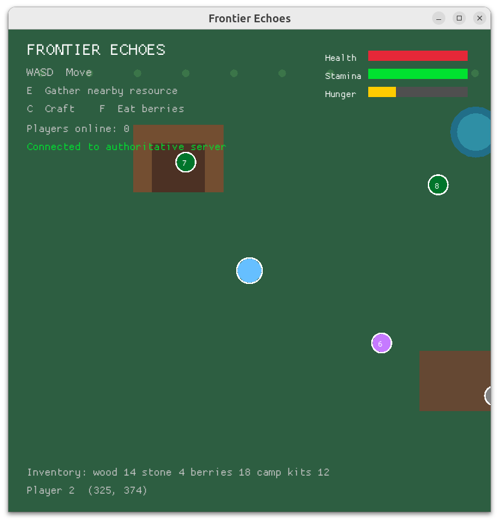

# Frontier Echoes

An open-world multiplayer survival game built with Rust.

The project is being developed as a server-authoritative multiplayer vertical slice first.
The initial world is a small island where players explore, gather resources, build shelters,
and discover abandoned research facilities.

## Client preview



## Workspace

- `crates/client` — client entry point and rendering/input code
- `crates/server` — authoritative world simulation and backend entry point
- `crates/shared` — types shared by the client and server
- `docs/architecture.md` — initial technical boundaries
- `docs/database.md` — PostgreSQL migration workflow
- `MILESTONES.md` — staged development roadmap and acceptance criteria

## Getting started

Install stable Rust, then run:

```bash
cargo check --workspace
cargo test --workspace
cargo run -p frontier-server
cargo run -p frontier-client
```

## Server configuration

Copy `.env.example` to `.env` and replace `DATABASE_URL` with the connection string for
your existing PostgreSQL database. Set `REDIS_URL` to your existing Redis server. The
`.env` file is ignored by Git.

```bash
cp .env.example .env
cargo run -p frontier-server
```

The server now connects to PostgreSQL and saves each authenticated character's position
every five seconds. The UDP address, tick rate, and maximum database connection setting
can be changed in `.env`.

The server also provides the world asset manifest over HTTP on `GAME_ASSET_ADDR`. The
manifest is loaded from the PostgreSQL `game_assets` table, and the client downloads it
before opening the game window.

The first authentication API is available on `GAME_API_ADDR`:

```bash
curl -X POST http://127.0.0.1:8080/auth/signup \
  -H 'content-type: application/json' \
  -d '{"username":"pilot1","password":"correct horse battery staple"}'

curl -X POST http://127.0.0.1:8080/auth/login \
  -H 'content-type: application/json' \
  -d '{"username":"pilot1","password":"correct horse battery staple"}'
```

The client now displays a login screen after loading the world asset. Use the keyboard
to enter credentials, `Tab` to switch fields, `Enter` to submit, and `F2` to switch
between login and signup. The returned Redis-backed session token is kept in memory and
sent in the UDP authentication handshake.

For automated or headless testing, the client also accepts a token through
`GAME_SESSION_TOKEN`:

```bash
GAME_SESSION_TOKEN=<token-from-signup-or-login> cargo run -p frontier-client
```

The server resolves the token in Redis, then loads that account's character from
PostgreSQL. Tokens are currently sent over the prototype UDP protocol without transport
encryption; an encrypted transport will be required before production deployment.

## Server tracing

The server emits structured `tracing` logs to stdout. To export spans over OTLP/gRPC to an
OpenTelemetry Collector or Jaeger, set this in `.env`:

```env
OTEL_EXPORTER_OTLP_ENDPOINT=http://localhost:4317
RUST_LOG=frontier_server=info
```

For local Jaeger development:

```bash
docker run --rm -p 16686:16686 -p 4317:4317 \
  -e COLLECTOR_OTLP_ENABLED=true jaegertracing/all-in-one:latest
```

View traces at `http://localhost:16686`.

The first playable slice now includes a Macroquad graphical client and a UDP server.
Start the server in one terminal, then start the client in another:

```bash
cargo run -p frontier-server
cargo run -p frontier-client
```

Use `W`, `A`, `S`, and `D` to move. Press `E` near a resource node to gather wood, stone,
or berries. Press `F` to eat one berry and restore hunger. Press `C` to open the crafting
panel and `Enter` to craft a camp kit when you have enough materials. The server validates movement, interactions, and crafting,
then sends authoritative positions, resource counts, and inventory stacks back to the client.
Movement consumes stamina, hunger decreases over time, and starvation damages health;
these survival values are persisted with the character.
